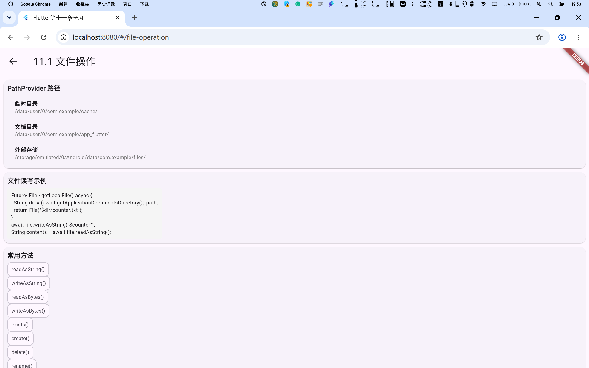
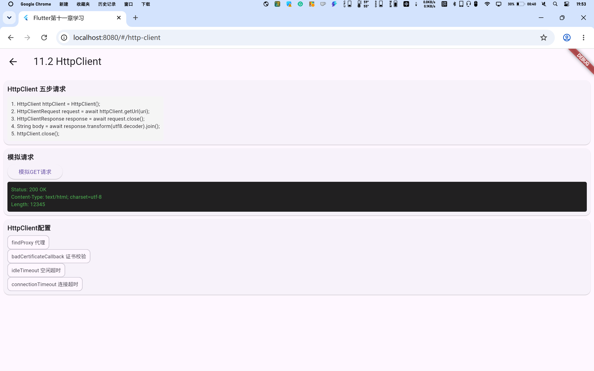
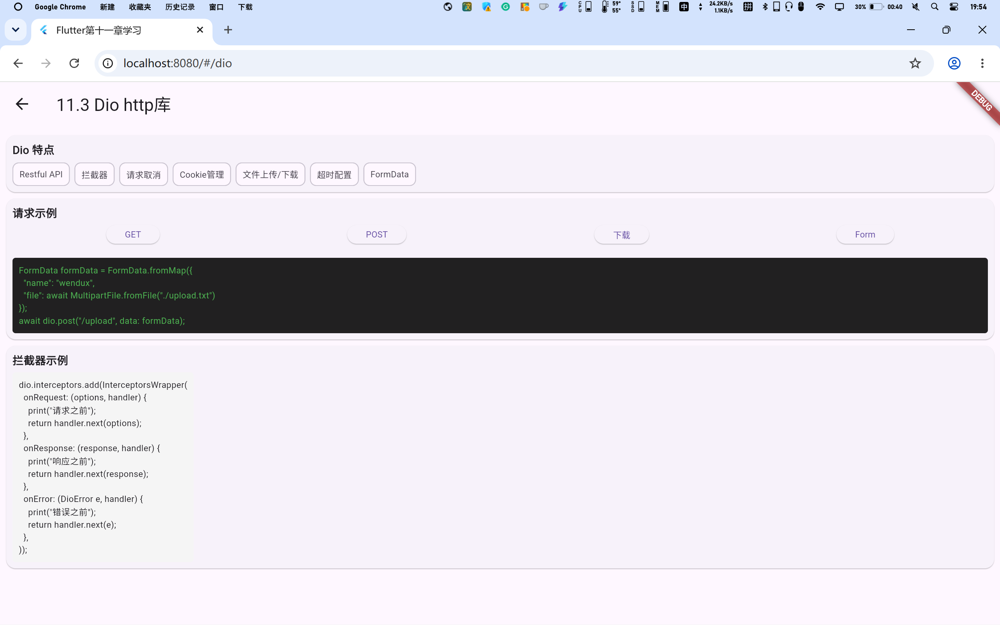
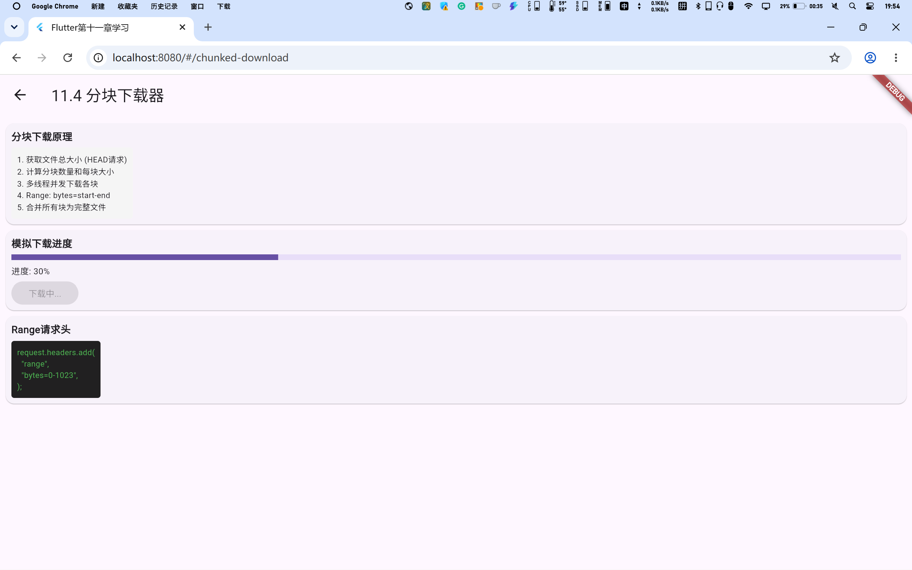
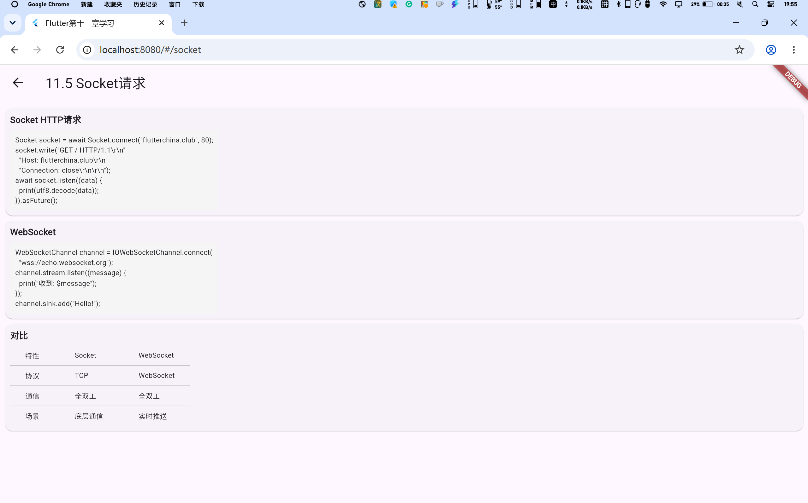
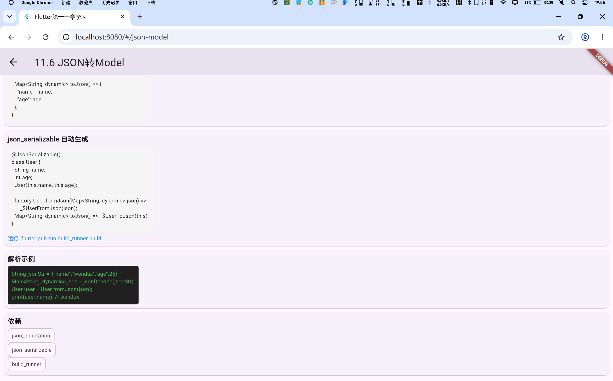

# Chapter 11 - 文件操作与网络请求

《Flutter实战》第十一章学习展示项目。

## 参考教材

📚 [《Flutter实战》第十一章 - 文件操作与网络请求](https://book.flutterchina.club/chapter11/)

## 学习目标

掌握Flutter文件操作与网络请求，包括：
- 文件操作
- HttpClient发起HTTP请求
- Dio http库
- 分块下载器
- Socket请求
- JSON转Dart Model

## 项目结构

```
lib/
├── main.dart                     # 主入口，导航页面
└── pages/
    ├── file_operation_page.dart    # 11.1 文件操作
    ├── http_client_page.dart       # 11.2 HttpClient
    ├── dio_page.dart               # 11.3 Dio http库
    ├── chunked_download_page.dart  # 11.4 分块下载器
    ├── socket_page.dart            # 11.5 Socket请求
    ├── json_model_page.dart        # 11.6 JSON转Model
    └── extended_counter_page.dart  # 扩展功能：持久化计数器
```

## 11.1 文件操作

### 知识点说明

- **path_provider**：获取文件系统路径
- **临时目录**：getTemporaryDirectory()
- **文档目录**：getApplicationDocumentsDirectory()
- **外部存储**：getExternalStorageDirectory()

### 核心代码

```dart
Future<File> getLocalFile() async {
  String dir = (await getApplicationDocumentsDirectory()).path;
  return File('$dir/counter.txt');
}
```

### 截图展示



## 11.2 HttpClient

### 知识点说明

- **HttpClient**：Dart IO库提供的HTTP请求类
- **五步请求流程**：创建→打开连接→等待响应→读取内容→关闭
- **配置选项**：代理、证书校验、超时

### 核心代码

```dart
HttpClient httpClient = HttpClient();
HttpClientRequest request = await httpClient.getUrl(uri);
HttpClientResponse response = await request.close();
String body = await response.transform(utf8.decoder).join();
httpClient.close();
```

### 截图展示



## 11.3 Dio http库

### 知识点说明

- **Dio**：强大的Dart HTTP请求库
- **功能特性**：Restful API、拦截器、请求取消、Cookie管理
- **文件上传/下载**：支持FormData和下载进度

### 核心代码

```dart
Dio dio = Dio();
Response response = await dio.get("/test", queryParameters: {"id": 12});
```

### 截图展示



## 11.4 分块下载器

### 知识点说明

- **Range请求头**：指定下载的文件范围
- **多线程下载**：并发下载多个文件块
- **合并文件**：将下载的块合并为完整文件

### 截图展示



## 11.5 Socket请求

### 知识点说明

- **Socket**：使用TCP协议进行底层通信
- **WebSocket**：全双工通信协议
- **HTTP over Socket**：手动构造HTTP请求

### 核心代码

```dart
Socket socket = await Socket.connect("host", 80);
socket.write("GET / HTTP/1.1\r\nHost: host\r\n\r\n");
socket.listen((data) => print(utf8.decode(data)));
```

### 截图展示



## 11.6 JSON转Model

### 知识点说明

- **手动解析**：使用factory构造函数fromJson/toJson
- **json_serializable**：自动生成解析代码
- **build_runner**：运行代码生成工具

### 核心代码

```dart
factory User.fromJson(Map<String, dynamic> json) {
  return User(name: json["name"], age: json["age"]);
}
```

### 截图展示



## 扩展功能：持久化计数器

### 知识点说明

- **数据持久化**：将计数器值保存到本地文件
- **path_provider**：获取应用文档目录路径
- **文件读写**：使用dart:io进行文件操作
- **生命周期**：在initState中读取文件，在操作时写入文件

### 核心代码

```dart
Future<File> _getLocalFile() async {
  String dir = (await getApplicationDocumentsDirectory()).path;
  return File('$dir/counter.txt');
}

Future<int> _readCounter() async {
  try {
    File file = await _getLocalFile();
    return int.parse(await file.readAsString());
  } on FileSystemException {
    return 0;
  }
}

Future<void> _incrementCounter() async {
  setState(() => _counter++);
  await (await _getLocalFile()).writeAsString('$_counter');
}
```

### 截图展示


## 快速开始

```bash
# 安装依赖
flutter pub get

# 运行项目（Web）
flutter run -d chrome

# 构建Web版本
flutter build web
```

## Chrome中运行

在Chrome中运行时，可以通过点击首页的卡片进入各个章节的展示页面：

1. 启动项目：`flutter run -d chrome`
2. 浏览器会自动打开，显示首页导航
3. 点击对应章节卡片，跳转到具体展示页面
4. 使用浏览器的返回按钮或左上角返回箭头返回首页

## 学习笔记

### 重点总结

1. **path_provider**：不同平台的文件路径不同，使用path_provider统一管理
2. **HttpClient**：Dart原生HTTP库，适合简单的HTTP请求
3. **Dio**：功能强大的第三方库，适合复杂的HTTP请求场景
4. **分块下载**：大文件下载时使用Range请求头实现断点续传
5. **Socket**：适合需要底层控制的场景，WebSocket适合实时通信
6. **JSON解析**：手动解析适合简单场景，json_serializable适合复杂模型

### 常见问题

- **Web端文件操作受限**：Web端无法直接访问本地文件系统，需要使用特定API
- **CORS跨域问题**：Web端请求API时可能遇到跨域限制
- **Dio版本差异**：Dio API随版本升级可能变化，以官方文档为准
