# Chapter 3 - 基础组件

《Flutter实战》第三章学习展示项目。

## 参考教材

📚 [《Flutter实战》第三章 - 基础组件](https://book.flutterchina.club/chapter3/)

## 学习目标

掌握Flutter基础组件的使用，包括：
- 文本及样式组件
- 按钮组件
- 图片及ICON组件
- 单选开关和复选框组件
- 输入框及表单组件
- 进度指示器组件

## 项目结构

```
lib/
├── main.dart                 # 主入口，导航页面
└── pages/
    ├── text_style_page.dart  # 3.1 文本及样式
    ├── button_page.dart      # 3.2 按钮
    ├── image_icon_page.dart  # 3.3 图片及ICON
    ├── checkbox_switch_page.dart  # 3.4 单选开关和复选框
    ├── input_form_page.dart  # 3.5 输入框及表单
    └── progress_indicator_page.dart  # 3.6 进度指示器
```

## 3.1 文本及样式

### 知识点说明

- **Text组件**：Flutter中最基本的文本展示组件
- **TextStyle**：用于定义文本样式，包括字体大小、颜色、粗细、斜体等
- **TextAlign**：文本对齐方式（left、center、right、justify）
- **RichText**：富文本组件，支持同一文本中使用不同样式
- **TextOverflow**：文本溢出处理（ellipsis、clip、fade）

### 核心代码

```dart
// 基础文本
Text('Hello Flutter', style: TextStyle(fontSize: 20));

// 富文本
RichText(
  text: TextSpan(
    text: 'Hello ',
    style: TextStyle(color: Colors.black),
    children: [
      TextSpan(
        text: 'Flutter',
        style: TextStyle(color: Colors.blue, fontWeight: FontWeight.bold),
      ),
    ],
  ),
);
```

### 截图展示

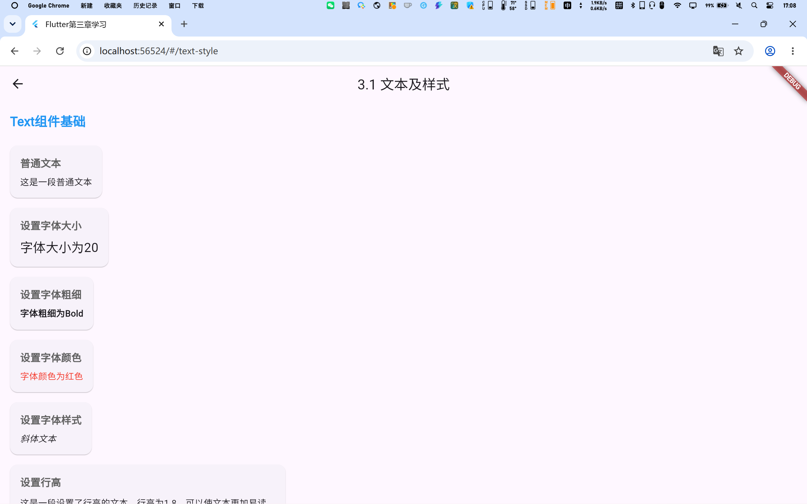
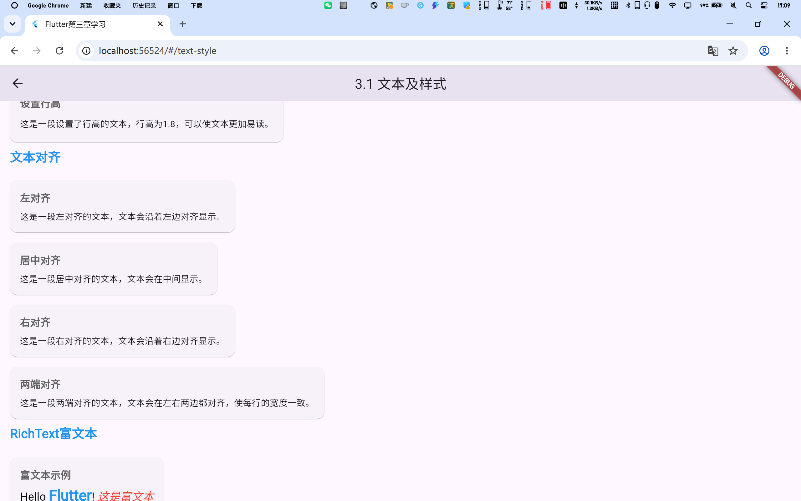

## 3.2 按钮

### 知识点说明

- **ElevatedButton**：凸起按钮，带有阴影效果
- **TextButton**：文本按钮，无背景色
- **OutlinedButton**：轮廓按钮，有边框无背景
- **IconButton**：图标按钮
- 按钮状态：enabled/disabled

### 核心代码

```dart
// 凸起按钮
ElevatedButton(
  onPressed: () {},
  child: const Text('点击我'),
);

// 带图标按钮
ElevatedButton.icon(
  onPressed: () {},
  icon: const Icon(Icons.add),
  label: const Text('添加'),
);

// 文本按钮
TextButton(
  onPressed: () {},
  child: const Text('取消'),
);
```

### 截图展示

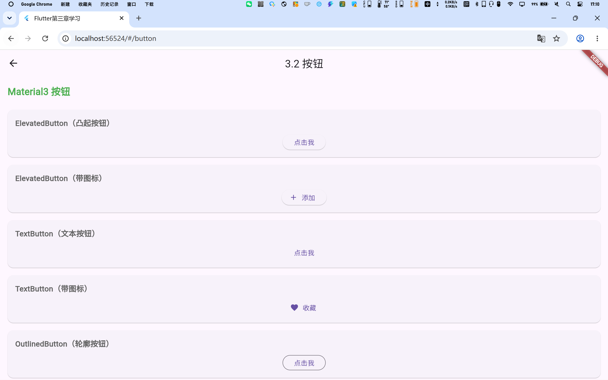
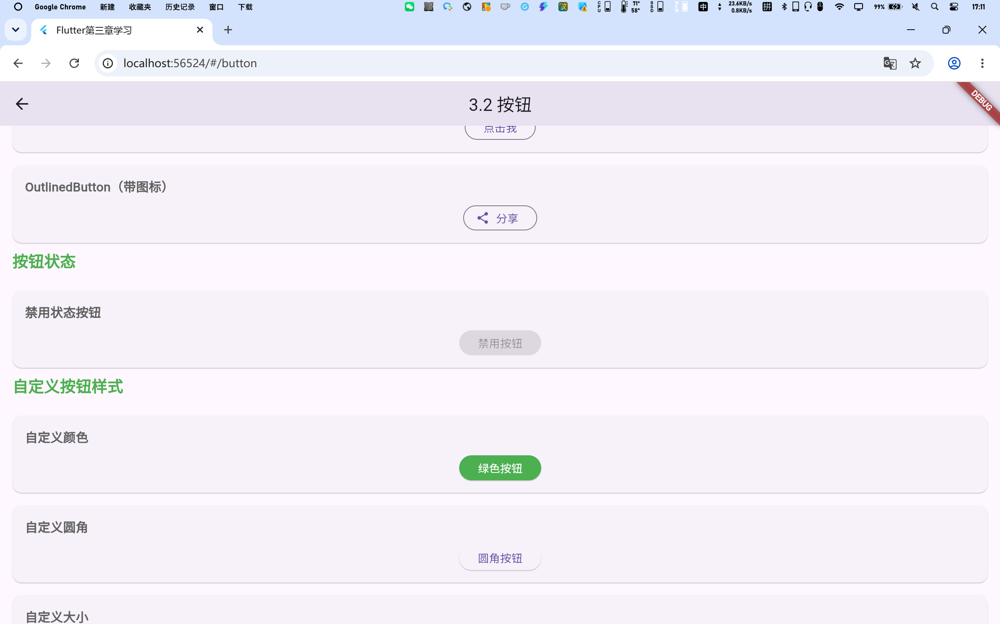

## 3.3 图片及ICON

### 知识点说明

- **Image.network**：加载网络图片
- **Image.asset**：加载本地资源图片
- **BoxFit**：图片填充模式（cover、contain、fill等）
- **Icon**：Material图标组件
- **IconButton**：可交互的图标按钮

### 核心代码

```dart
// 网络图片
Image.network(
  'https://picsum.photos/200/150',
  fit: BoxFit.cover,
);

// 圆形图片
ClipOval(
  child: Image.network(
    'https://picsum.photos/150/150',
    fit: BoxFit.cover,
  ),
);

// 图标
Icon(Icons.home, size: 40, color: Colors.blue);
```

### 截图展示

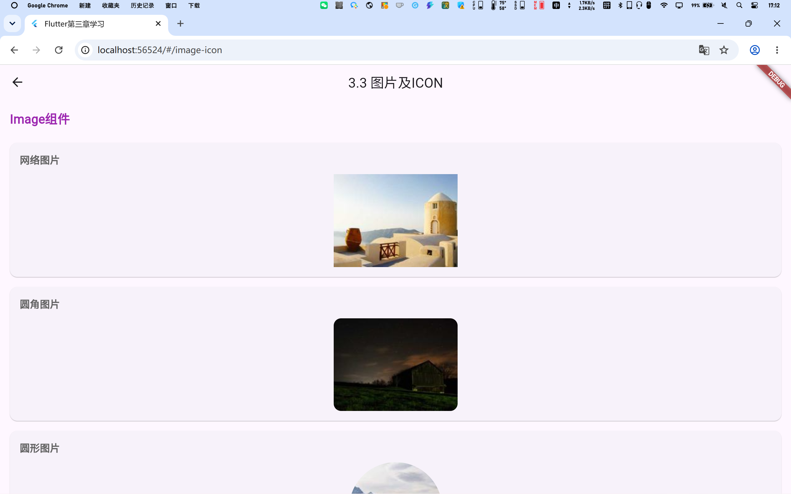
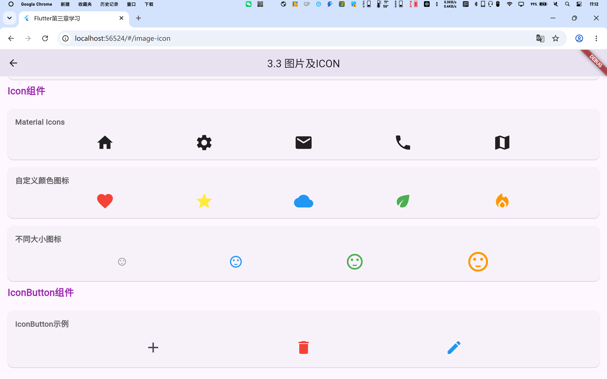

## 3.4 单选开关和复选框

### 知识点说明

- **Checkbox**：复选框，支持多选
- **CheckboxListTile**：带标签的复选框
- **Switch**：开关组件
- **SwitchListTile**：带标签的开关
- **Radio**：单选框，同一组只能选一个

### 核心代码

```dart
// 复选框
Checkbox(
  value: isChecked,
  onChanged: (value) {
    setState(() => isChecked = value!);
  },
);

// 开关
Switch(
  value: isSwitched,
  onChanged: (value) {
    setState(() => isSwitched = value);
  },
);

// 单选框
Radio(
  value: 'option1',
  groupValue: selectedRadio,
  onChanged: (value) {
    setState(() => selectedRadio = value);
  },
);
```

### 截图展示

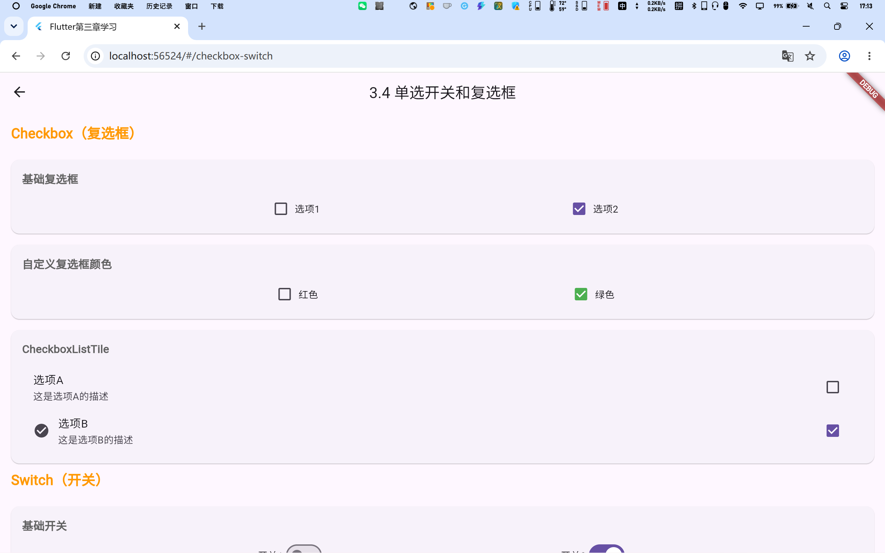
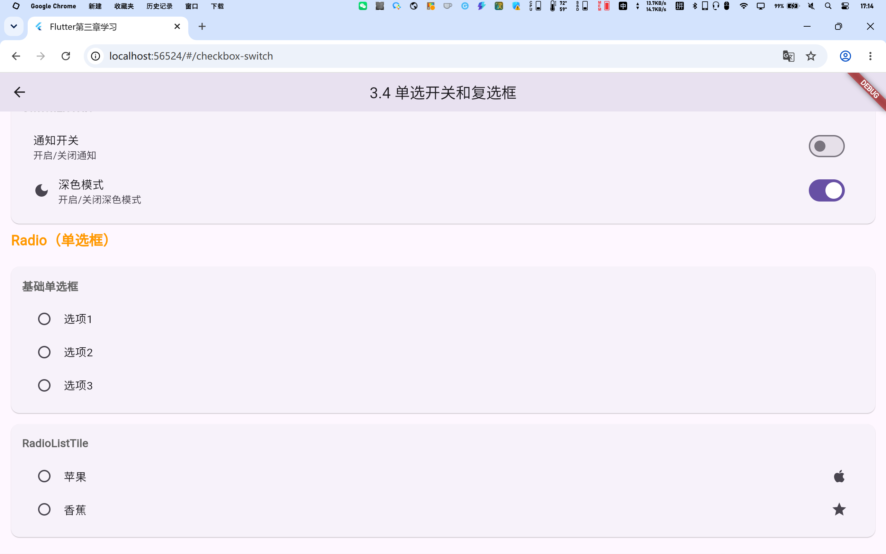

## 3.5 输入框及表单

### 知识点说明

- **TextField**：单行文本输入框
- **TextFormField**：表单中的文本输入框，支持验证
- **Form**：表单组件，管理多个FormField
- **InputDecoration**：输入框装饰（标签、提示、图标等）
- 表单验证：通过validator回调实现

### 核心代码

```dart
// 基础输入框
TextField(
  decoration: InputDecoration(
    labelText: '用户名',
    hintText: '请输入用户名',
    border: OutlineInputBorder(),
  ),
);

// 表单验证
Form(
  key: _formKey,
  child: TextFormField(
    validator: (value) {
      if (value == null || value.isEmpty) {
        return '请输入内容';
      }
      return null;
    },
  ),
);
```

### 截图展示

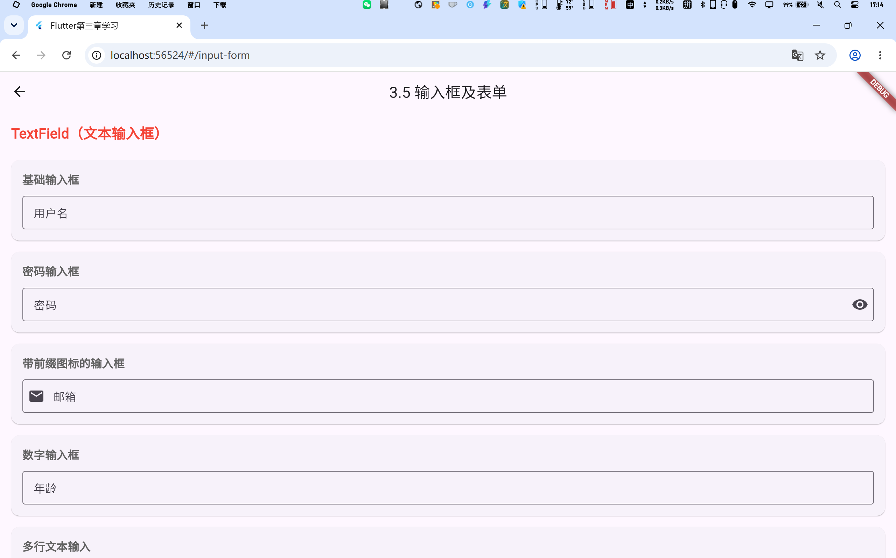
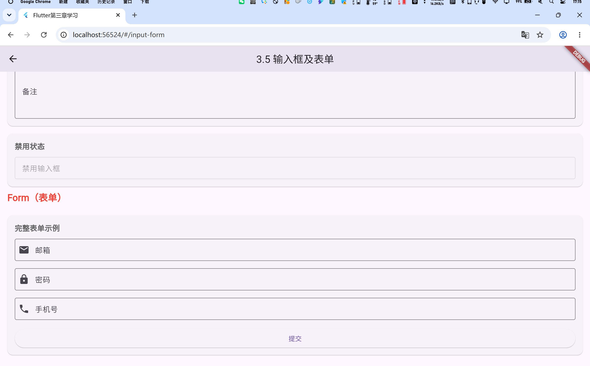

## 3.6 进度指示器

### 知识点说明

- **LinearProgressIndicator**：线性进度条
- **CircularProgressIndicator**：圆形进度条
- 确定进度：设置value属性（0.0-1.0）
- 不确定进度：不设置value，显示循环动画
- 自定义颜色和样式

### 核心代码

```dart
// 线性进度条（确定进度）
LinearProgressIndicator(value: 0.5);

// 圆形进度条（不确定进度）
CircularProgressIndicator();

// 自定义颜色
CircularProgressIndicator(
  value: 0.7,
  backgroundColor: Colors.grey,
  valueColor: AlwaysStoppedAnimation<Color>(Colors.blue),
);
```

### 截图展示

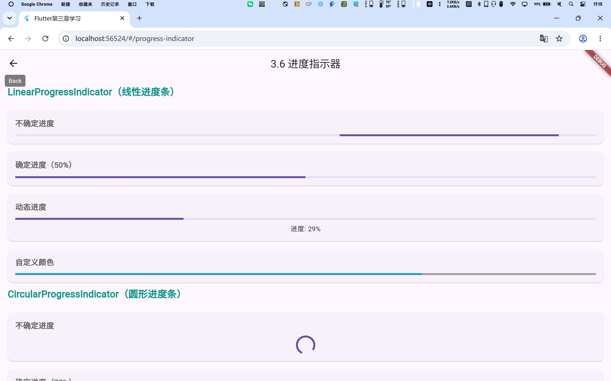
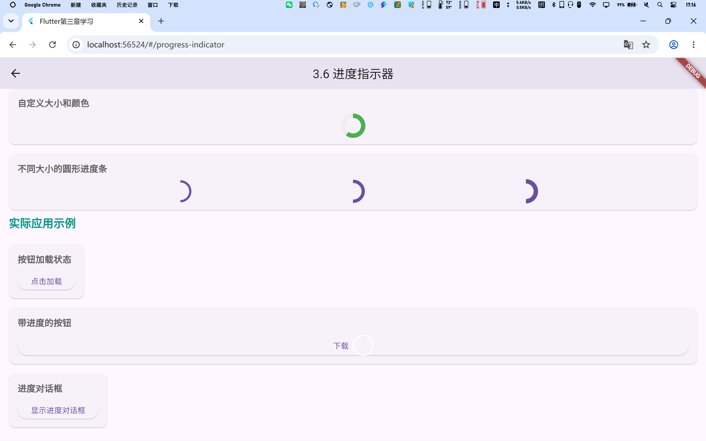

## 快速开始

```bash
# 安装依赖
flutter pub get

# 运行项目（Web）
flutter run -d chrome

# 构建Web版本
flutter build web
```

## Chrome中运行

在Chrome中运行时，可以通过点击首页的卡片进入各个章节的展示页面：

1. 启动项目：`flutter run -d chrome`
2. 浏览器会自动打开，显示首页导航
3. 点击对应章节卡片，跳转到具体展示页面
4. 使用浏览器的返回按钮或左上角返回箭头返回首页

## 学习笔记

### 重点总结

1. **Text组件**：通过TextStyle控制样式，支持富文本
2. **按钮组件**：Material3推荐使用ElevatedButton、TextButton、OutlinedButton
3. **图片加载**：注意处理加载状态和错误情况
4. **表单验证**：使用Form和validator实现数据验证
5. **状态管理**：使用setState管理组件内部状态

### 常见问题

- **图片不显示**：检查网络权限或资源路径
- **表单验证不生效**：确保使用TextFormField并正确配置validator
- **按钮点击无响应**：检查onPressed回调是否正确设置