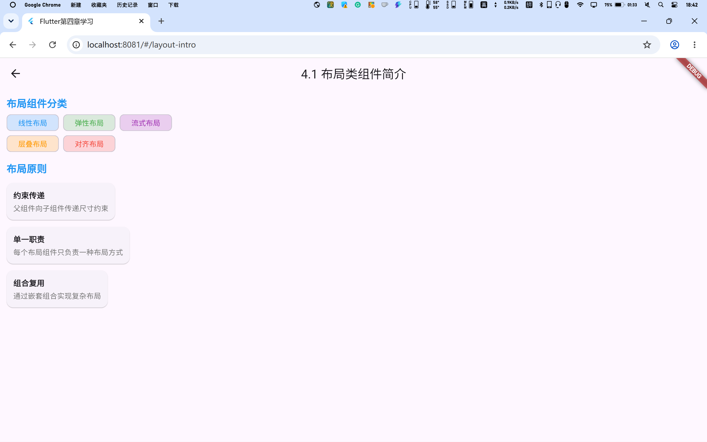
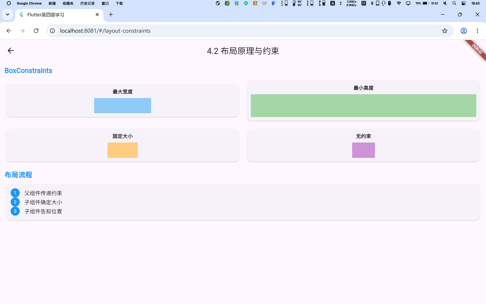
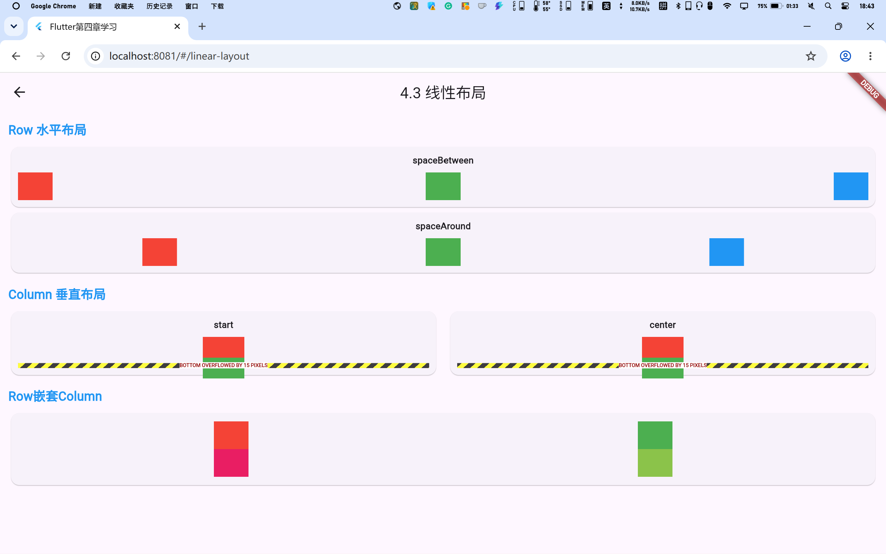
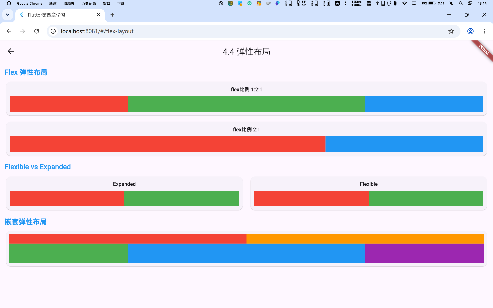
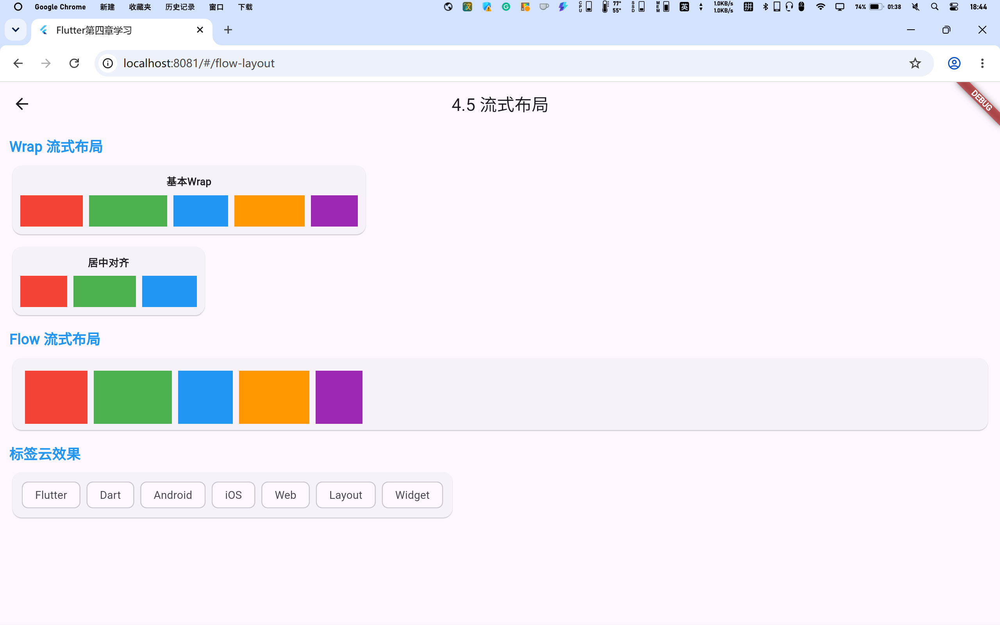
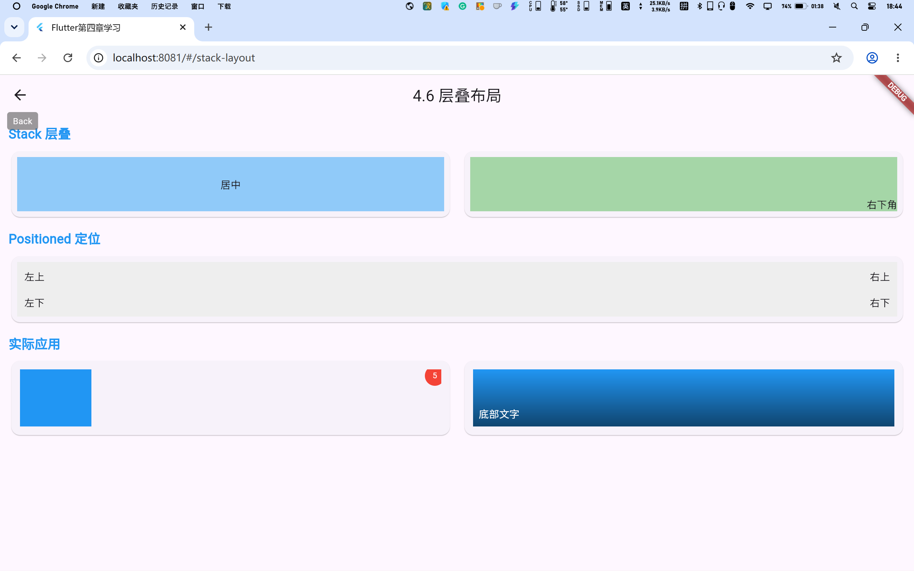
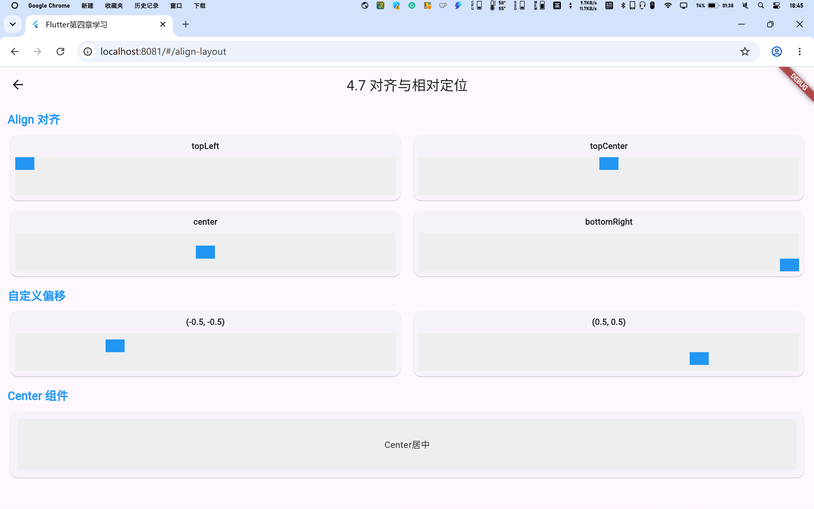
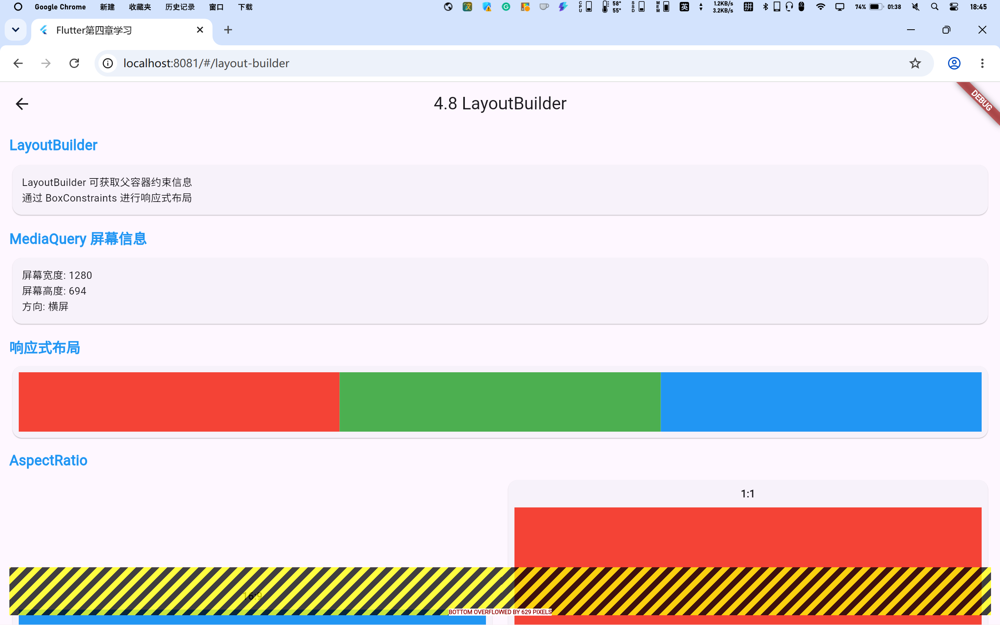

# Chapter 4 - 布局类组件

《Flutter实战》第四章学习展示项目。

## 参考教材

📚 [《Flutter实战》第四章 - 布局类组件](https://book.flutterchina.club/chapter4/)

## 学习目标

掌握Flutter布局类组件的使用，包括：
- 布局类组件概述
- 布局原理与约束 (constraints)
- 线性布局 (Row、Column)
- 弹性布局 (Flex)
- 流式布局 (Wrap、Flow)
- 层叠布局 (Stack、Positioned)
- 对齐与相对定位 (Align)
- LayoutBuilder、AfterLayout

## 项目结构

```
lib/
├── main.dart                   # 主入口，导航页面
└── pages/
    ├── layout_intro_page.dart  # 4.1 布局类组件简介
    ├── layout_constraints_page.dart  # 4.2 布局原理与约束
    ├── linear_layout_page.dart # 4.3 线性布局
    ├── flex_layout_page.dart   # 4.4 弹性布局
    ├── flow_layout_page.dart   # 4.5 流式布局
    ├── stack_layout_page.dart  # 4.6 层叠布局
    ├── align_layout_page.dart  # 4.7 对齐与相对定位
    └── layout_builder_page.dart # 4.8 LayoutBuilder
```

## 4.1 布局类组件简介

### 知识点说明

- **布局组件分类**：线性布局、弹性布局、流式布局、层叠布局、对齐布局
- **布局组件作用**：控制子组件位置、控制子组件大小、管理子组件排列
- **布局原则**：单一职责原则、约束传递原则

### 核心代码

```dart
// 布局组件分类
// 1. 线性布局：Row（水平）、Column（垂直）
// 2. 弹性布局：Flex、Expanded
// 3. 流式布局：Wrap、Flow
// 4. 层叠布局：Stack、Positioned
// 5. 对齐布局：Align、Center
```

### 截图展示



## 4.2 布局原理与约束

### 知识点说明

- **BoxConstraints**：最常用的约束类型，包含minWidth、maxWidth、minHeight、maxHeight
- **UnconstrainedBox**：不受约束的容器
- **ConstrainedBox**：自定义约束的容器
- **约束传递**：从上到下传递约束，子组件根据父组件约束确定大小

### 核心代码

```dart
// 最大宽度约束
ConstrainedBox(
  constraints: BoxConstraints(maxWidth: 200),
  child: Container(color: Colors.blue),
);

// 固定大小约束
ConstrainedBox(
  constraints: BoxConstraints(
    minWidth: 100, maxWidth: 100,
    minHeight: 50, maxHeight: 50,
  ),
  child: Container(color: Colors.red),
);
```

### 截图展示



## 4.3 线性布局

### 知识点说明

- **Row**：水平方向布局
- **Column**：垂直方向布局
- **MainAxisAlignment**：主轴对齐方式（start、center、end、spaceBetween、spaceAround）
- **CrossAxisAlignment**：交叉轴对齐方式

### 核心代码

```dart
// Row水平布局
Row(
  mainAxisAlignment: MainAxisAlignment.spaceBetween,
  children: [
    Container(width: 60, height: 60, color: Colors.red),
    Container(width: 60, height: 60, color: Colors.green),
    Container(width: 60, height: 60, color: Colors.blue),
  ],
);

// Column垂直布局
Column(
  crossAxisAlignment: CrossAxisAlignment.center,
  children: [
    Container(width: 80, height: 40, color: Colors.red),
    Container(width: 60, height: 40, color: Colors.green),
  ],
);
```

### 截图展示



## 4.4 弹性布局

### 知识点说明

- **Flex**：弹性布局容器
- **Expanded**：强制填充剩余空间
- **Flexible**：可选填充剩余空间
- **flex属性**：控制子组件占用空间的比例

### 核心代码

```dart
// Flex弹性布局
Flex(
  direction: Axis.horizontal,
  children: [
    Expanded(flex: 1, child: Container(color: Colors.red)),
    Expanded(flex: 2, child: Container(color: Colors.green)),
    Expanded(flex: 1, child: Container(color: Colors.blue)),
  ],
);

// Flexible vs Expanded
Row(
  children: [
    Flexible(flex: 1, child: Container(color: Colors.red)),
    Flexible(flex: 2, child: Container(color: Colors.green)),
  ],
);
```

### 截图展示



## 4.5 流式布局

### 知识点说明

- **Wrap**：自动换行布局，超出宽度自动换行
- **Flow**：高效的流式布局，需要自定义delegate
- **spacing**：子组件之间的间距
- **runSpacing**：行/列之间的间距

### 核心代码

```dart
// Wrap流式布局
Wrap(
  spacing: 8,
  runSpacing: 8,
  children: [
    Container(width: 80, height: 40, color: Colors.red),
    Container(width: 100, height: 40, color: Colors.green),
    Container(width: 70, height: 40, color: Colors.blue),
  ],
);

// 标签云效果
Wrap(
  spacing: 8,
  children: [
    Chip(label: Text('Flutter')),
    Chip(label: Text('Dart')),
    Chip(label: Text('Layout')),
  ],
);
```

### 截图展示



## 4.6 层叠布局

### 知识点说明

- **Stack**：层叠布局容器
- **Positioned**：绝对定位组件
- **alignment**：子组件对齐方式
- **实际应用**：角标、遮罩层、浮动按钮等

### 核心代码

```dart
// Stack层叠布局
Stack(
  children: [
    Container(width: 200, height: 100, color: Colors.red),
    Positioned(
      top: 10,
      left: 10,
      child: Text('层叠文字'),
    ),
  ],
);

// 带角标的图片
Stack(
  children: [
    Container(width: 150, height: 120, color: Colors.blue),
    Positioned(
      top: -5,
      right: -5,
      child: CircleAvatar(
        backgroundColor: Colors.red,
        radius: 16,
        child: Text('5'),
      ),
    ),
  ],
);
```

### 截图展示



## 4.7 对齐与相对定位

### 知识点说明

- **Align**：对齐组件，支持自定义对齐位置
- **Center**：居中对齐，是Align的特例
- **Alignment**：使用坐标系统（-1到1）
- **FractionalOffset**：使用比例系统（0到1）

### 核心代码

```dart
// Align对齐
Align(
  alignment: Alignment.center,
  child: Text('居中对齐'),
);

Align(
  alignment: Alignment(-0.5, 0.5),
  child: Text('自定义位置'),
);

// Center居中
Center(child: Text('居中显示'));
```

### 截图展示



## 4.8 LayoutBuilder

### 知识点说明

- **LayoutBuilder**：获取父组件约束信息
- **MediaQuery**：获取屏幕尺寸和方向信息
- **AspectRatio**：强制宽高比
- **响应式布局**：根据屏幕尺寸动态调整布局

### 核心代码

```dart
// LayoutBuilder获取约束
LayoutBuilder(
  builder: (context, constraints) {
    return Text('宽度: ${constraints.maxWidth}');
  },
);

// MediaQuery获取屏幕信息
MediaQueryData mediaQuery = MediaQuery.of(context);
print('屏幕宽度: ${mediaQuery.size.width}');

// AspectRatio宽高比
AspectRatio(
  aspectRatio: 16 / 9,
  child: Container(color: Colors.blue),
);
```

### 截图展示



## 快速开始

```bash
# 安装依赖
flutter pub get

# 运行项目（Web）
flutter run -d chrome

# 构建Web版本
flutter build web
```

## Chrome中运行

在Chrome中运行时，可以通过点击首页的卡片进入各个章节的展示页面：

1. 启动项目：`flutter run -d chrome`
2. 浏览器会自动打开，显示首页导航
3. 点击对应章节卡片，跳转到具体展示页面
4. 使用浏览器的返回按钮或左上角返回箭头返回首页

## 学习笔记

### 重点总结

1. **约束传递**：父组件向子组件传递约束，子组件根据约束确定大小
2. **Row/Column**：最常用的线性布局组件，控制水平/垂直排列
3. **Expanded**：弹性布局的核心，按比例分配剩余空间
4. **Wrap**：自动换行布局，适合标签云等场景
5. **Stack**：层叠布局，适合需要覆盖层的场景
6. **LayoutBuilder**：响应式布局的关键，根据父约束动态调整

### 常见问题

- **组件不显示**：检查约束是否正确，确保有足够空间
- **布局溢出**：考虑使用Wrap替代Row/Column
- **定位不准确**：检查Positioned的left/top/right/bottom属性
- **响应式失效**：确保使用LayoutBuilder或MediaQuery