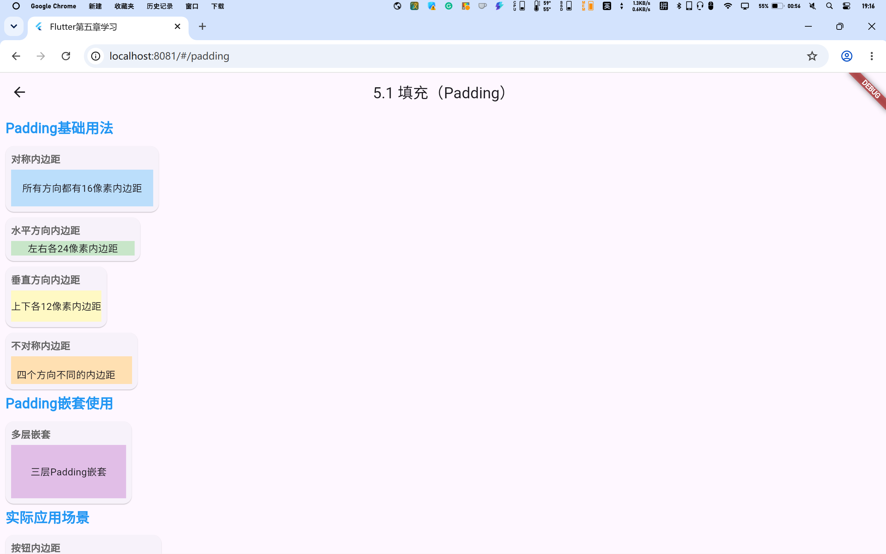
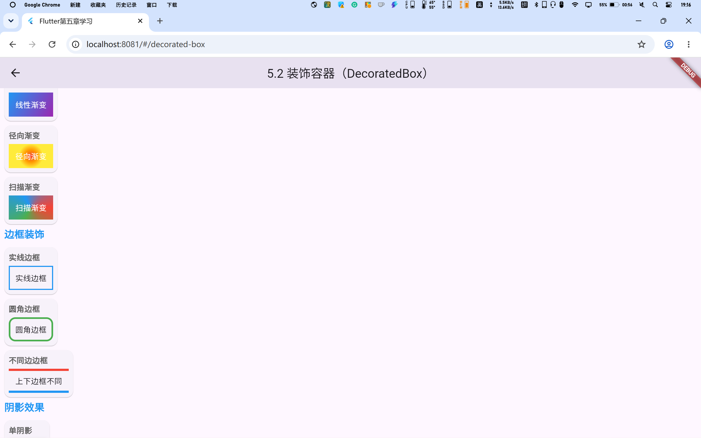
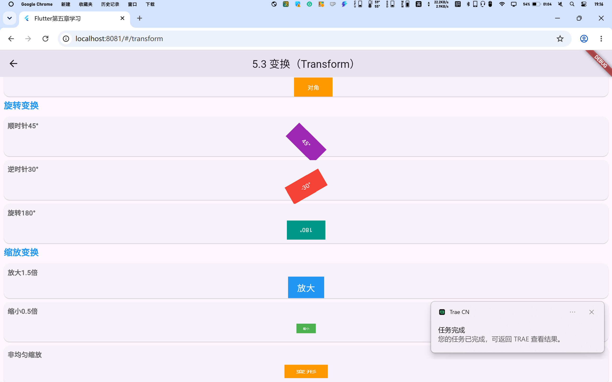
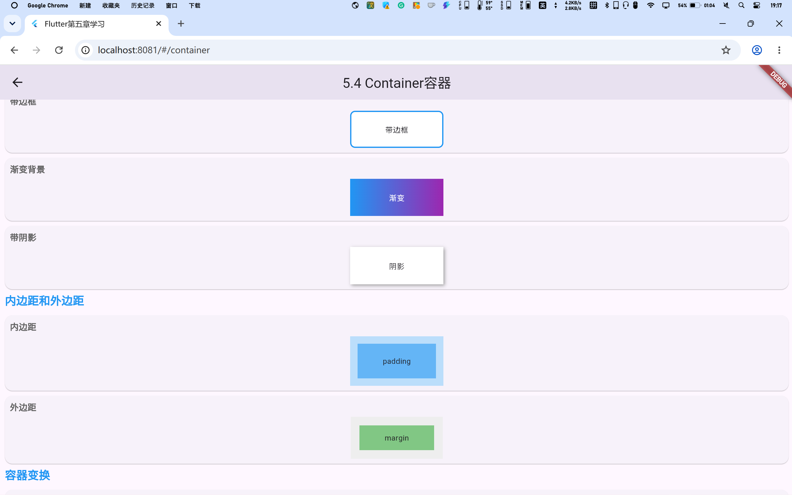
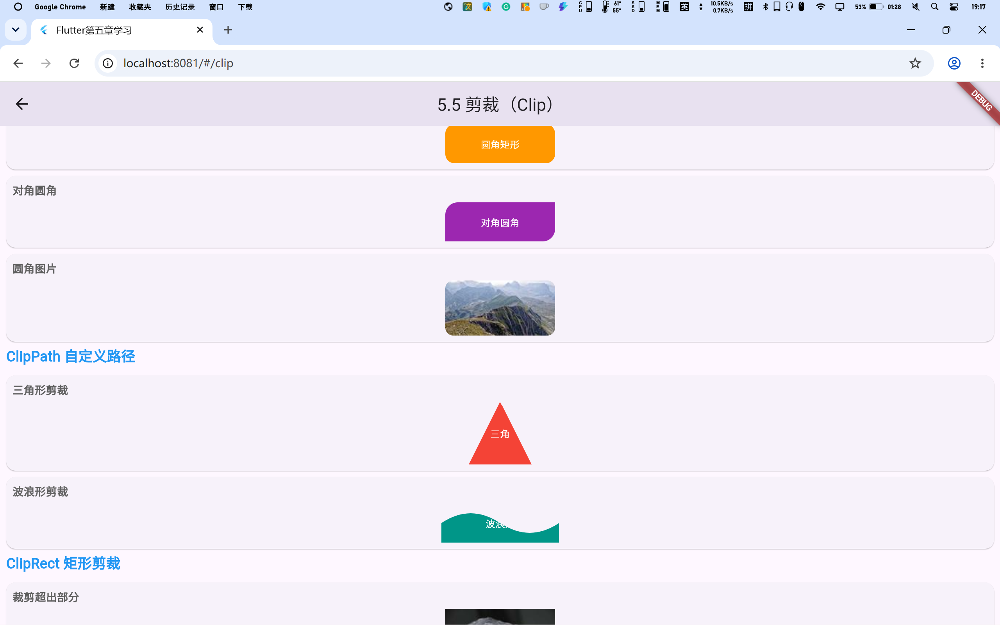
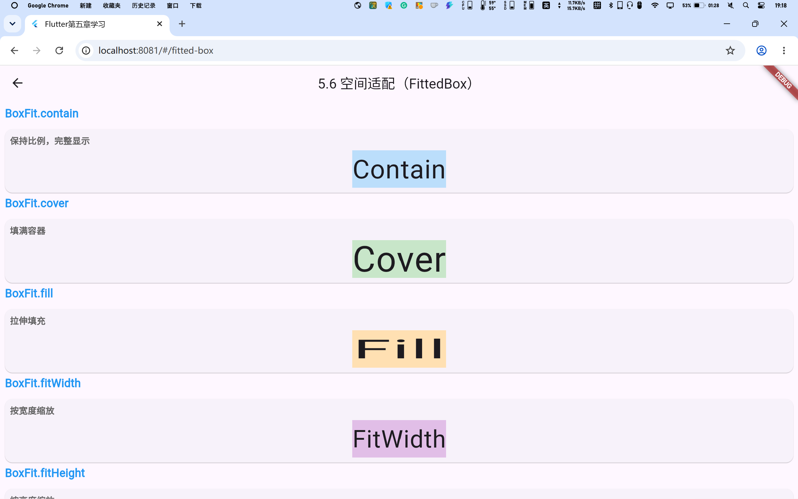
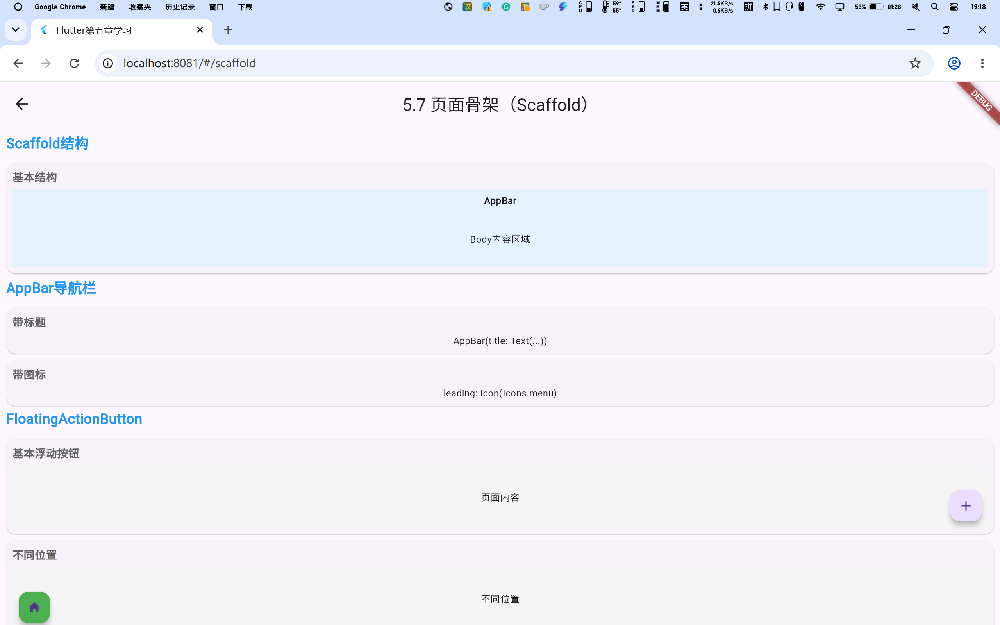

# Chapter 5 - 容器类组件

《Flutter实战》第五章学习展示项目。

## 参考教材

📚 [《Flutter实战》第五章 - 容器类组件](https://book.flutterchina.club/chapter5/)

## 学习目标

掌握Flutter容器类组件的使用，包括：
- Padding填充组件
- DecoratedBox装饰容器
- Transform变换组件
- Container容器
- Clip剪裁组件
- FittedBox空间适配
- Scaffold页面骨架

## 项目结构

```
lib/
├── main.dart                 # 主入口，导航页面
└── pages/
    ├── padding_page.dart     # 5.1 填充（Padding）
    ├── decorated_box_page.dart  # 5.2 装饰容器（DecoratedBox）
    ├── transform_page.dart   # 5.3 变换（Transform）
    ├── container_page.dart   # 5.4 Container容器
    ├── clip_page.dart        # 5.5 剪裁（Clip）
    ├── fitted_box_page.dart  # 5.6 空间适配（FittedBox）
    └── scaffold_page.dart    # 5.7 页面骨架（Scaffold）
```

## 5.1 填充（Padding）

### 知识点说明

- **Padding组件**：用于给子组件添加内边距
- **EdgeInsets.all()**：所有方向相同的内边距
- **EdgeInsets.symmetric()**：水平或垂直方向的对称内边距
- **EdgeInsets.only()**：针对特定方向设置内边距

### 核心代码

```dart
// 所有方向内边距
Padding(
  padding: EdgeInsets.all(16),
  child: Text('内容'),
);

// 水平方向内边距
Padding(
  padding: EdgeInsets.symmetric(horizontal: 24),
  child: Text('内容'),
);

// 特定方向内边距
Padding(
  padding: EdgeInsets.only(left: 8, top: 16),
  child: Text('内容'),
);
```

### 截图展示



## 5.2 装饰容器（DecoratedBox）

### 知识点说明

- **DecoratedBox**：用于绘制装饰效果的容器
- **BoxDecoration**：定义装饰属性
- **背景色**：通过color属性设置
- **渐变**：支持LinearGradient、RadialGradient、SweepGradient
- **边框**：通过border属性设置
- **阴影**：通过boxShadow属性设置

### 核心代码

```dart
DecoratedBox(
  decoration: BoxDecoration(
    color: Colors.blue,
    borderRadius: BorderRadius.circular(8),
    border: Border.all(color: Colors.black),
    boxShadow: [
      BoxShadow(
        color: Colors.grey,
        offset: Offset(2, 2),
        blurRadius: 4,
      ),
    ],
  ),
  child: Padding(
    padding: EdgeInsets.all(16),
    child: Text('装饰容器'),
  ),
);
```

### 截图展示



## 5.3 变换（Transform）

### 知识点说明

- **Transform.translate()**：平移变换
- **Transform.rotate()**：旋转变换
- **Transform.scale()**：缩放变换
- **Matrix4**：自定义矩阵变换
- 变换不会影响布局，只改变绘制位置

### 核心代码

```dart
// 平移
Transform.translate(
  offset: Offset(20, 0),
  child: Text('平移文本'),
);

// 旋转（45度）
Transform.rotate(
  angle: 45 * 3.14159 / 180,
  child: Text('旋转文本'),
);

// 缩放
Transform.scale(
  scale: 1.5,
  child: Text('缩放文本'),
);
```

### 截图展示



## 5.4 Container容器

### 知识点说明

- **Container**：组合容器，集成多种功能
- **尺寸**：width、height设置固定尺寸
- **内边距**：padding属性
- **外边距**：margin属性
- **装饰**：decoration属性（同DecoratedBox）
- **变换**：transform属性

### 核心代码

```dart
Container(
  width: 200,
  height: 100,
  margin: EdgeInsets.all(10),
  padding: EdgeInsets.all(16),
  decoration: BoxDecoration(
    color: Colors.blue,
    borderRadius: BorderRadius.circular(8),
  ),
  child: Text('Container容器'),
);
```

### 截图展示



## 5.5 剪裁（Clip）

### 知识点说明

- **ClipOval**：椭圆剪裁，可用于创建圆形头像
- **ClipRRect**：圆角矩形剪裁
- **ClipRect**：矩形剪裁
- **ClipPath**：自定义路径剪裁
- **CustomClipper**：自定义剪裁器

### 核心代码

```dart
// 圆形剪裁
ClipOval(
  child: Image.network('https://picsum.photos/150/150'),
);

// 圆角矩形剪裁
ClipRRect(
  borderRadius: BorderRadius.circular(12),
  child: Image.network('https://picsum.photos/200/100'),
);

// 自定义剪裁
ClipPath(
  clipper: MyCustomClipper(),
  child: Container(color: Colors.blue),
);
```

### 截图展示



## 5.6 空间适配（FittedBox）

### 知识点说明

- **FittedBox**：控制子组件如何适应可用空间
- **BoxFit.contain**：保持比例，完整显示
- **BoxFit.cover**：保持比例，填满容器
- **BoxFit.fill**：拉伸填充，不保持比例
- **BoxFit.fitWidth/Height**：按宽度/高度缩放
- **alignment**：对齐方式

### 核心代码

```dart
Container(
  width: 200,
  height: 100,
  color: Colors.grey[200],
  child: FittedBox(
    fit: BoxFit.contain,
    alignment: Alignment.center,
    child: Text('需要适配的文本'),
  ),
);
```

### 截图展示



## 5.7 页面骨架（Scaffold）

### 知识点说明

- **Scaffold**：Material风格页面的骨架组件
- **appBar**：顶部导航栏
- **body**：主内容区域
- **floatingActionButton**：浮动操作按钮
- **bottomNavigationBar**：底部导航栏
- **drawer/endDrawer**：侧边栏抽屉
- **SnackBar**：底部消息提示

### 核心代码

```dart
Scaffold(
  appBar: AppBar(
    title: Text('页面标题'),
    centerTitle: true,
  ),
  body: const Center(
    child: Text('页面内容'),
  ),
  floatingActionButton: FloatingActionButton(
    onPressed: () {},
    child: const Icon(Icons.add),
  ),
  bottomNavigationBar: BottomNavigationBar(
    items: const [
      BottomNavigationBarItem(
        icon: Icon(Icons.home),
        label: '首页',
      ),
    ],
  ),
);
```

### 截图展示



## 快速开始

```bash
# 安装依赖
flutter pub get

# 运行项目（Web）
flutter run -d chrome

# 构建Web版本
flutter build web
```

## Chrome中运行

在Chrome中运行时，可以通过点击首页的卡片进入各个章节的展示页面：

1. 启动项目：`flutter run -d chrome`
2. 浏览器会自动打开，显示首页导航
3. 点击对应章节卡片，跳转到具体展示页面
4. 使用浏览器的返回按钮或左上角返回箭头返回首页

## 学习笔记

### 重点总结

1. **Padding**：用于控制组件内边距，是布局的基础组件
2. **DecoratedBox**：专注于绘制装饰效果，不影响布局
3. **Transform**：实现平移、旋转、缩放等变换，变换不影响布局
4. **Container**：组合容器，集成了多种功能，是最常用的容器组件
5. **Clip**：实现各种形状的剪裁效果，常用于图片处理
6. **FittedBox**：控制子组件如何适应可用空间，解决内容溢出问题
7. **Scaffold**：Material页面的骨架，提供标准的页面结构

### 常见问题

- **Transform不影响布局**：Transform的变换只影响绘制，不影响布局位置
- **Container与DecoratedBox区别**：Container是组合组件，DecoratedBox只负责装饰
- **FittedBox缩放问题**：注意BoxFit的不同取值，选择合适的适配方式
- **Scaffold组件冲突**：确保Scaffold的子组件正确使用上下文