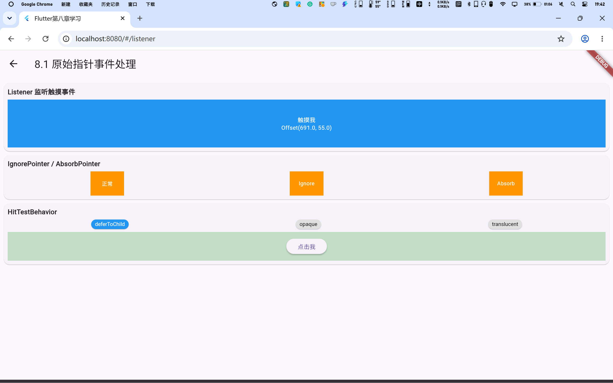
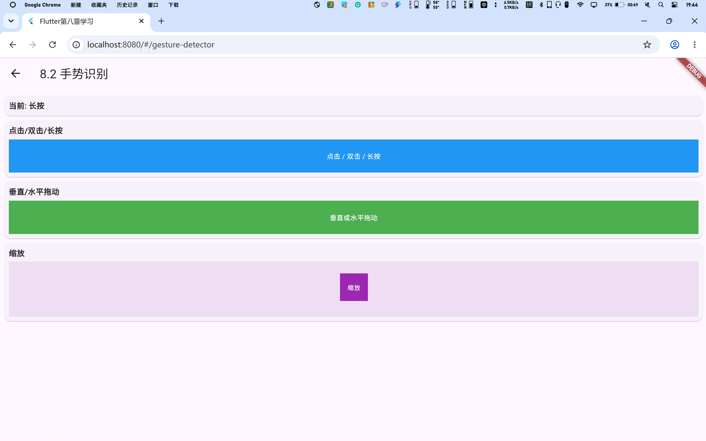
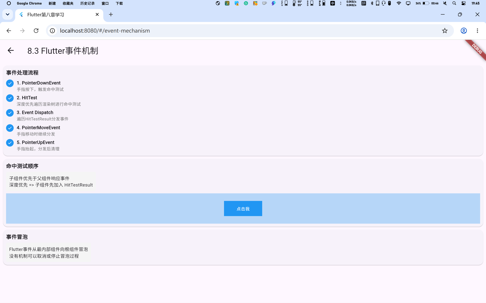
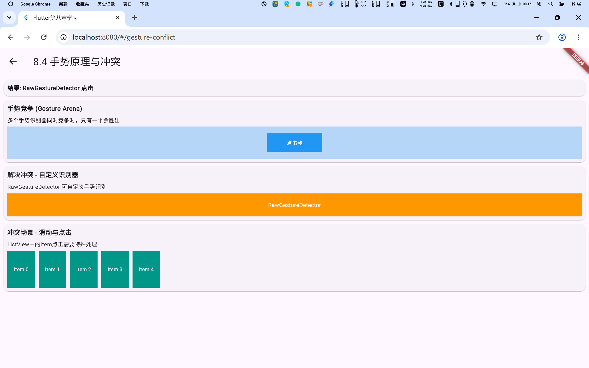
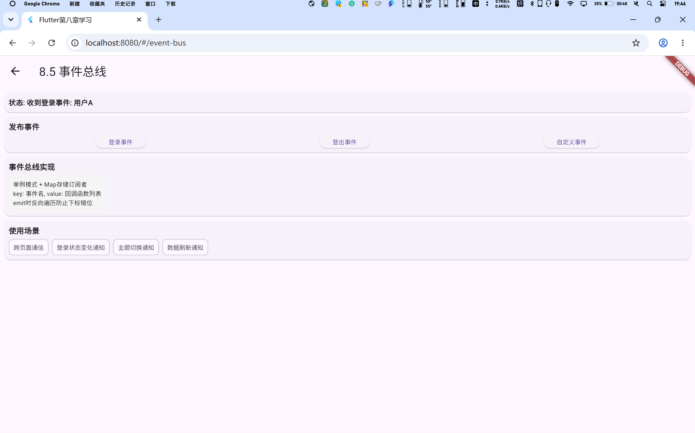
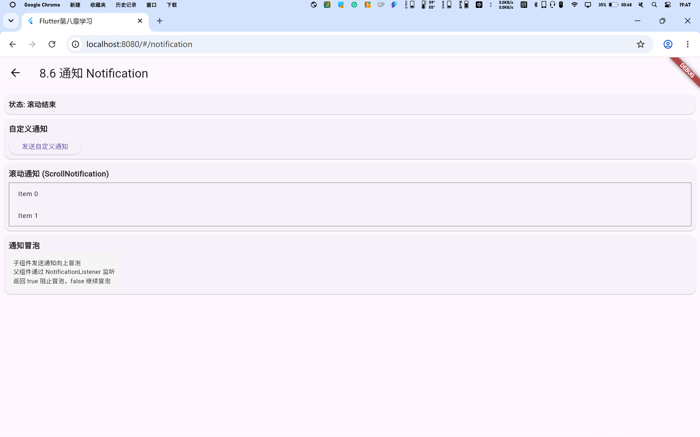

# Chapter 8 - 事件处理与通知

《Flutter实战》第八章学习展示项目。

## 参考教材

📚 [《Flutter实战》第八章 - 事件处理与通知](https://book.flutterchina.club/chapter8/)

## 学习目标

掌握Flutter事件处理机制，包括：
- 原始指针事件处理
- 手势识别
- Flutter事件机制
- 手势原理与冲突
- 事件总线
- 通知 Notification

## 项目结构

```
lib/
├── main.dart                 # 主入口，导航页面
└── pages/
    ├── listener_page.dart          # 8.1 原始指针事件处理
    ├── gesture_detector_page.dart  # 8.2 手势识别
    ├── event_mechanism_page.dart   # 8.3 Flutter事件机制
    ├── gesture_conflict_page.dart  # 8.4 手势原理与冲突
    ├── event_bus_page.dart         # 8.5 事件总线
    └── notification_page.dart      # 8.6 通知 Notification
```

## 8.1 原始指针事件处理

### 知识点说明

- **Listener**：监听原始指针事件
- **PointerEvent**：指针事件基类
- **IgnorePointer/AbsorbPointer**：忽略指针事件
- **HitTestBehavior**：命中测试行为

### 核心代码

```dart
Listener(
  onPointerDown: (e) => print('按下'),
  onPointerMove: (e) => print('移动'),
  onPointerUp: (e) => print('抬起'),
  child: Container(...),
);
```

### 截图展示



## 8.2 手势识别

### 知识点说明

- **GestureDetector**：手势检测组件
- **onTap/onDoubleTap/onLongPress**：点击手势
- **onVerticalDrag/onHorizontalDrag**：拖动手势
- **onScaleUpdate**：缩放手势

### 核心代码

```dart
GestureDetector(
  onTap: () => print('单击'),
  onDoubleTap: () => print('双击'),
  onLongPress: () => print('长按'),
  child: Container(...),
);
```

### 截图展示



## 8.3 Flutter事件机制

### 知识点说明

- **命中测试 (Hit Test)**：深度优先遍历渲染树
- **事件分发 (Event Dispatch)**：遍历HitTestResult列表
- **事件冒泡**：从最内部组件向根组件冒泡

### 截图展示



## 8.4 手势原理与冲突

### 知识点说明

- **手势竞争 (Gesture Arena)**：多个手势识别器竞争
- **RawGestureDetector**：自定义手势识别器
- **手势冲突解决**：滑动与点击共存

### 截图展示



## 8.5 事件总线

### 知识点说明

- **EventBus**：全局事件总线
- **单例模式**：static变量+工厂构造函数
- **订阅者模式**：发布者和订阅者

### 核心代码

```dart
// 订阅事件
bus.on('login', (arg) => print(arg));

// 触发事件
bus.emit('login', userInfo);
```

### 截图展示



## 8.6 通知 Notification

### 知识点说明

- **Notification**：通知机制
- **NotificationListener**：监听通知
- **通知冒泡**：子组件向父组件冒泡

### 核心代码

```dart
NotificationListener<MyNotification>(
  onNotification: (notification) {
    print(notification.msg);
    return true; // 阻止冒泡
  },
  child: child,
);
```

### 截图展示



## 快速开始

```bash
# 安装依赖
flutter pub get

# 运行项目（Web）
flutter run -d chrome

# 构建Web版本
flutter build web
```

## Chrome中运行

在Chrome中运行时，可以通过点击首页的卡片进入各个章节的展示页面：

1. 启动项目：`flutter run -d chrome`
2. 浏览器会自动打开，显示首页导航
3. 点击对应章节卡片，跳转到具体展示页面
4. 使用浏览器的返回按钮或左上角返回箭头返回首页

## 学习笔记

### 重点总结

1. **Listener**：用于监听原始指针事件，是底层事件处理的基础
2. **GestureDetector**：封装了常见的手势识别，是日常开发中最常用的
3. **事件机制**：理解命中测试和事件分发流程，有助于解决复杂交互问题
4. **手势冲突**：了解Gesture Arena的工作原理，能更好地处理手势竞争
5. **事件总线**：适合简单的跨组件通信，复杂场景建议使用状态管理方案
6. **Notification**：适合子组件向父组件传递信息，与事件总线方向相反

### 常见问题

- **事件不响应**：检查组件是否通过命中测试，是否被IgnorePointer包裹
- **手势冲突**：使用RawGestureDetector自定义手势识别优先级
- **事件总线内存泄漏**：记得在dispose中取消订阅
